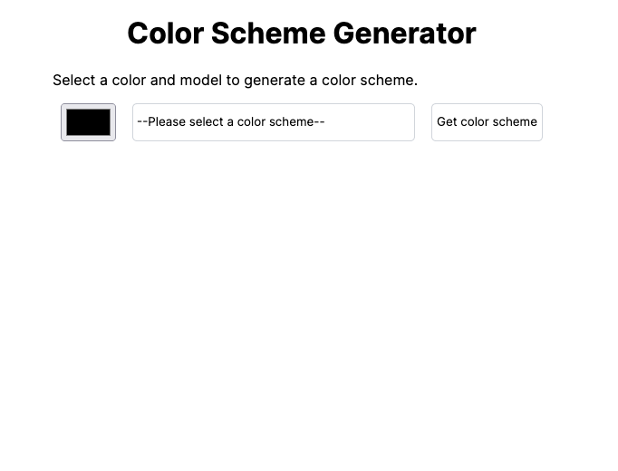
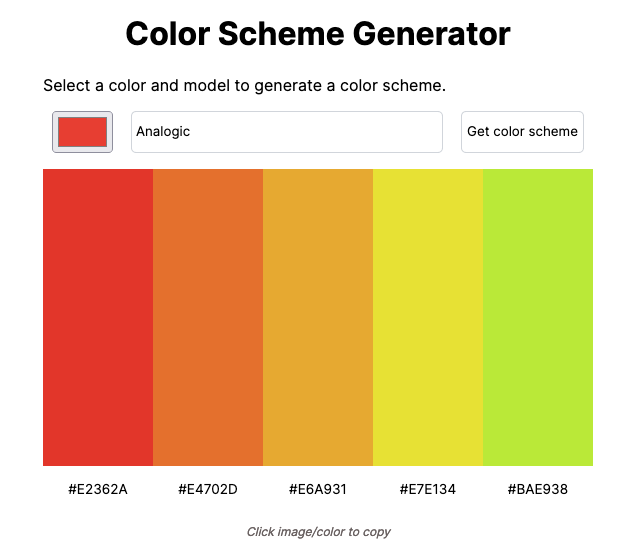

# Color Scheme Picker 

Uses [the Color API](https://www.thecolorapi.com/) to generate color schemes based on seed color and color scheme mode.

## Contents 

- [Overview](#overview)
  - [Project Requirements](#project-requirements)
  - [Project Resources](#project-resources)
- [My Process](#my-process)
  - [Built with](#built-with)
- [Screenshots](#screenshots)
- [Status](#status)
- [Connect](#connect)

## Overview 

This my solution to the solo project for Module 9 of [Scrimba.com's Front-end Developer Career Path](https://scrimba.com/learn/frontend).

### Project Requirements
- Choose ‘seed color’ with `<input type='color' />`
- Choose color scheme mode in `<select>` box
- Clicking button makes request to the Color API to get a color scheme
- Display the scheme colors and hex values on the page
- Stretch goal: click on the hex or color and copy to clipboard

### Project Resources 
- [Figma file](https://www.figma.com/file/twasy8Bca4hW7gunLFSLoY/Color-Scheme-Generator?node-id=2-1155)
- [The Color API Doccumentation](https://www.thecolorapi.com/docs#schemes)

## My Process

For this project, I started with a basic layout of the page elements, added functionality with JavaScript, and then styled the page according to the style guide. 

### Built with

- HTML
- CSS
- JavaScript
- REST API

## Screenshots

## Status 

The demo version of this project can be viewed at: https://ananfito.github.io/color-scheme-generator/.

## Connect

Thank you for reading about this project. If you'd like to connect with me for mentoring, collaboration, or employment opportunities, you can do so via the following links:

- [Email](https://anthonynanfito.com/contact/)
- [LinkedIn](https://linkedin.com/in/anthonynanfito)
- [Portfolio](https://ananfito.github.io)
- [Blog](https://ananfito.hashnode.dev)
